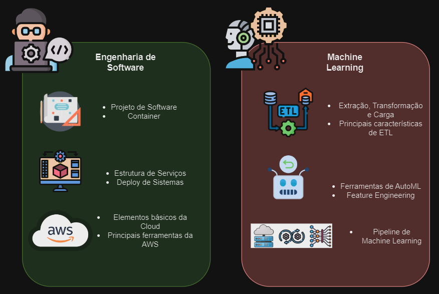

# M7-Inteli-Eng-Comp
Repositório utilizado para compartilhar os materiais de desenvolvimento no módulo 7 do curso de Engenharia de Computação. Os materiais serão consentrados neste repositório, em conjunto com seus respectivos links para acessos externos quando necessário.

| ***IMPORTANTE:*** Para os estudos que forem cards de Estudos Complementares, não se esqueção de passar o card para concluído quando terminarem o estudo. 

## Roadmap do Módulo 7 - Programação

A estrutura do curso foi pensada para que os alunos possam ter uma visão geral de como os conceitos de programação são aplicados em diferentes áreas da computação. Para isso, o módulo foi dividido em 2 partes principais:

- Engenharia de Software
- Machine Learning

  

Componentes Principais do Módulo 7

Este roadmap tem por objetivo apresentar os principais elementos que serão abordados ao longo do módulo. O roadmap será atualizado conforme o andamento do módulo.

  

Roadmap do Módulo 7

## Encontros do Módulo

Encontro 01 - Containers

 
<strong>Objetivo do Encontro:</strong>

Este encontro tem por objetivo apresentar os conceitos básicos de containers, bem como sua utilização e principais ferramentas para o desenvolvimento de aplicações em containers.

<strong>Estudos Complementares:</strong>

- [Descomplicando o Docker](https://livro.descomplicandodocker.com.br/)
- [Introdução aos containers](https://www.redhat.com/pt-br/topics/containers)
- [Um guia para iniciantes em Docker — como criar sua primeira aplicação com o Docker](https://www.freecodecamp.org/portuguese/news/um-guia-para-iniciantes-em-docker-como-criar-sua-primeira-aplicacao-com-o-docker/)
- [Docker - Instalação, Configuração e Primeiros Passos](https://balta.io/blog/docker-instalacao-configuracao-e-primeiros-passos)
- [Aprenda Docker do Zero, tutorial passo a passo.](https://www.youtube.com/watch?v=8MJWke19g8U)
- [Learn Docker in 7 Easy Steps - Full Beginner's Tutorial](https://www.youtube.com/watch?v=gAkwW2tuIqE)
- [Entendendo Funcionamento de Containers](https://www.youtube.com/watch?v=85k8se4Zo70)
- [Podman vs. Docker](https://www.youtube.com/watch?v=Xx588nbshlM)
- [Podman](https://podman.io/)

<strong>Slides da Aula:</strong>

- [Slides Encontro 01](https://slides.com/murilozaninidecarvalho/code)

<strong>Questionários Complementares:</strong>
- TODO

Encontro 02 - Arquitetura de Software e Introdução ao Cloud

 
<strong>Objetivo do Encontro:</strong>

O objetivo deste encontro é a discussão de conceitos de arquitetura de software, trazendo a visão das regras de negócio para definir as técnicas e algoritmos utilizados. Serão abordados de forma prática alguns dos design patterns mais comuns.

<strong>Estudos Complementares:</strong>

- [FastAPI in Containers - Docker](https://fastapi.tiangolo.com/deployment/docker/)
- [10 MOST POPULAR SOFTWARE ARCHITECTURAL PATTERNS](https://nix-united.com/blog/10-common-software-architectural-patterns-part-1/)
- [10 Software Architecture Patterns in Enterprise Software Development](https://blog.devgenius.io/10-software-architecture-patterns-in-enterprise-software-development-fabacb5ed0c8)
- [14 software architecture design patterns to know](https://www.redhat.com/architect/14-software-architecture-patterns)
- [20 System Design Concepts Explained in 10 Minutes](https://www.youtube.com/watch?v=i53Gi_K3o7I)

<strong>Slides da Aula:</strong>

- [Slides Encontro 02](https://slides.com/murilozaninidecarvalho/code)

<strong>Questionários Complementares:</strong>

- TODO

Encontro 03 - Serviços de Cloud e Controle de Usuários

 
<strong>Objetivo do Encontro:</strong>

- O objetivo principal do encontro é possibilitar que os alunos consigam compreender como a autenticação de usuários é realizada e a importancia deste processo.

<strong>Estudos Complementares:</strong>

- [FastAPI Authentication with JWT (JSON Web Tokens)](https://www.youtube.com/watch?v=0_seNFCtglk)
- [JWT](https://jwt.io/)
- [O que é JWT?](https://www.treinaweb.com.br/blog/o-que-e-jwt)
- [Using FastAPI inside Docker containers](https://blog.logrocket.com/using-fastapi-inside-docker-containers/)

<strong>Slides da Aula:</strong>

- [Slides Encontro 03](https://slides.com/murilozaninidecarvalho/code)

<strong>Questionários Complementares:</strong>
- TODO

Encontro 04 - Processo de ETL

 
<strong>Objetivo do Encontro:</strong>

- O objetivo principal do encontro é apresentar o processo de ETL (Extração, Transformação e Carga) de dados. Este processo será realziado em partes, com o intuíto de utilizar um abordagem didática, com dados reais e um contexto de mercado para os estudantes. Espera-se que com o final da instrução, os estudantes possam compreender o processo de ETL e como ele pode ser utilizado em contextos de dados.

<strong>Estudos Complementares:</strong>

- [ETL X ELT: qual a diferença?](https://academy.indicium.tech/blog/etl-vs-elt-diferencas)
- [Dólar comercial (venda e compra) - cotações diárias e Taxas de Câmbio - todos os boletins diários - v1](https://olinda.bcb.gov.br/olinda/servico/PTAX/versao/v1/documentacao#Moedas)
- [Dólar comercial (venda e compra) - cotações diárias e Taxas de Câmbio - todos os boletins diários](https://olinda.bcb.gov.br/olinda/servico/PTAX/versao/v1/swagger-ui3#/)
- [Banco Central do Brasil - API - Navegador de Dados](https://dadosabertos.bcb.gov.br/dataset/expectativas-mercado/resource/d420a704-75a7-4f45-8f4b-0fca813c70f0)
- [DBeaver Community](https://dbeaver.io/download/)

<strong>Slides da Aula:</strong>

- [Slides Encontro 04](https://slides.com/murilozaninidecarvalho/code)

<strong>Questionários Complementares:</strong>

- Durante a aula, criamos uma aplicação em nossa máquina local e acessamos os dados dentro do container. Coloque agora nossa aplicação dentro de um container e execute ela junto com o container do banco de dados.
- Crie uma interface que permite o usuário escolher a data que ele deseja realizar a extração dos dados. Essa interface pode ser via linha de comando (CLI).
- Adicione mais um container para navegar nos dados extraídos.
- ***DESAFIO:*** Construa uma interface gráfica que permita ao usuário visualizar os dados extraídos e buscar mais dados.

Encontro 05 - Banco de Dados Relacional

 
<strong>Objetivo do Encontro:</strong>

- O principal objetivo deste encontro é compreender como os bancos de dados relacionais são projetados e como deve acontecer sua utilização. Ao longo do encontro, espera-se que os estudantes também consigam estudar os fundamentos da linguagem SQL e consigam realizar a manipulação de dados com ela. Quanto a tecnologia utilizada, o banco Postgres será utilizado em conjunto com a linguagem Python para realizar a conecção aos bancos. Estimula-se que os estudantes explorem outras formas de se conectar ao banco de dados, com o JavaScript, por exemplo.

<strong>Estudos Complementares:</strong>

- [Modelagem de Dados - A abordagem Entidade-Relacionamento para Projeto Lógico; Peter Chen](https://www.amazon.com.br/Modelagem-Dados-Abordagem-Entidade-Relacionamento/dp/0074605755)
- [SQL em 10 Minutos por Dia; Ben Forta](https://www.amazon.com.br/SQL-10-Minutos-por-dia/dp/6586057442/ref=sr_1_1?keywords=sql+em+10+minutos&qid=1692367951&s=books&sprefix=sql+em+10%2Cstripbooks%2C413&sr=1-1)
- [Descrição das noções básicas de normalização do banco de dados](https://learn.microsoft.com/pt-br/office/troubleshoot/access/database-normalization-description)
- [Normalização em Banco de Dados - Estrutura](https://www.alura.com.br/artigos/normalizacao-banco-de-dados-estrutura)
- [Database Technology Evolution](https://arxiv.org/ftp/arxiv/papers/2303/2303.11748.pdf)
- [O que é um Banco de Dados?](https://www.oracle.com/br/database/what-is-database/)
- [db-engines](https://db-engines.com/en/)
- [What is DBMS? (Components, Features, Advantages)](https://databasetown.com/what-is-dbms-components-features-advantages/)

<strong>Slides da Aula:</strong>

- [Slides Encontro 05](https://slides.com/murilozaninidecarvalho/code)

<strong>Questionários Complementares:</strong>

- Tente reproduzir o que foi desenvolvido em aula utilizando SQLite.
- Tente reproduzri o que foi desenvolvido em aula utilizando MySQL.
- Ao realizar as tentativas anteriores, verifique o quanto do code base precisou ser alterado.

Encontro 06 - Banco de Dados Não Relacional

 
<strong>Objetivo do Encontro:</strong>
- TODO

<strong>Estudos Complementares:</strong>
- TODO

<strong>Slides da Aula:</strong>
- TODO

<strong>Questionários Complementares:</strong>
- TODO

Encontro 07 - Nivelamento de Machine Learning

 
<strong>Objetivo do Encontro:</strong>
- TODO

<strong>Estudos Complementares:</strong>
- TODO

<strong>Slides da Aula:</strong>
- TODO

<strong>Questionários Complementares:</strong>
- TODO

Encontro 08 - AutoML, Feature Engineering e Fine Tunning

 
<strong>Objetivo do Encontro:</strong>
- TODO

<strong>Estudos Complementares:</strong>
- TODO

<strong>Slides da Aula:</strong>
- TODO

<strong>Questionários Complementares:</strong>
- TODO

Encontro 09 - Deploy de Sistemas de Machine Learning e Streamlit

 
<strong>Objetivo do Encontro:</strong>
- TODO

<strong>Estudos Complementares:</strong>
- TODO

<strong>Slides da Aula:</strong>
- TODO

<strong>Questionários Complementares:</strong>
- TODO

Encontro 10 - Sistemas de troca de informação/mensageria

 
<strong>Objetivo do Encontro:</strong>
- TODO

<strong>Estudos Complementares:</strong>
- TODO

<strong>Slides da Aula:</strong>
- TODO

<strong>Questionários Complementares:</strong>
- TODO

Encontro 11 - Integração de Dados (API) com o Front

 
<strong>Objetivo do Encontro:</strong>
- TODO

<strong>Estudos Complementares:</strong>
- TODO

<strong>Slides da Aula:</strong>
- TODO

<strong>Questionários Complementares:</strong>
- TODO

Encontro 12 - Introdução as Séries Temporais

 
<strong>Objetivo do Encontro:</strong>
- TODO

<strong>Estudos Complementares:</strong>

- [How to Create an ARIMA Model for Time Series Forecasting in Python](https://machinelearningmastery.com/arima-for-time-series-forecasting-with-python/)
- [ARIMA Model – Complete Guide to Time Series Forecasting in Python](https://www.machinelearningplus.com/time-series/arima-model-time-series-forecasting-python/)
- [ARIMA Model for Time Series Forecasting](https://www.kaggle.com/code/prashant111/arima-model-for-time-series-forecasting)

<strong>Slides da Aula:</strong>
- TODO

<strong>Questionários Complementares:</strong>
- TODO

Encontro 13 - Desenvolvimento Assistido

 
<strong>Objetivo do Encontro:</strong>
- TODO

<strong>Estudos Complementares:</strong>
- TODO

<strong>Slides da Aula:</strong>
- TODO

<strong>Questionários Complementares:</strong>
- TODO

Encontro 14 - Refinamentos do Projeto

 
<strong>Objetivo do Encontro:</strong>
- TODO

<strong>Estudos Complementares:</strong>
- TODO

<strong>Slides da Aula:</strong>
- TODO

<strong>Questionários Complementares:</strong>
- TODO

## Links úteis

Alguns links úteis para o desenvolvimento do módulo 7.

- [Techguide para Desenvolvimento em IA - Módulo 1](https://techguide.sh/pt-BR/path/inteligencia-artificial/)
- [Trocando ideia e falando de #CRUDComQualidade](https://www.youtube.com/watch?v=s_NDuO1z88I)
- [Curso feliz de React - Básico - Jogo da Velha](https://www.youtube.com/watch?v=1g-tQSEgGyw&list=PLirko8T4cEmwkMsKEsEnHs6dUPcdqWVvX)
- [Curso de Responsivo Feliz com HTML e CSS](https://www.youtube.com/watch?v=HiPwxMcOILI&list=PLirko8T4cEmzidHx2hSE8NVdPgNXX-iEE)
- [Canal Marco Bruno](https://www.youtube.com/@MarcoBrunoDev)
- [React Hooks: Compound Components](https://kentcdodds.com/blog/compound-components-with-react-hooks)
- [Patterns.dev](https://www.patterns.dev/)

## Material de Referência

Material de apoio para quem desejar aprofundar seus conhecimentos em algum assunto específico abordado ao longo do módulo.

### ***Apache Parquet***

- [Apache Parquet](https://parquet.apache.org/)
- [O que são arquivos Parquet](https://www.alura.com.br/artigos/arquivos-parquet)
- [Porque utilizar Parquet](https://www.upsolver.com/blog/apache-parquet-why-use)

### ***Python Dask***

- [Dask](https://dask.org/)

### ***Design Systems***

- [Awesome Design Systems](https://github.com/alexpate/awesome-design-systems)

### ***Python para Frontend***

- [Reflex](https://reflex.dev/)
- [Reflex: Write Python and Build REACT.JS Apps](https://www.youtube.com/watch?v=YZIKsurfMQU)

