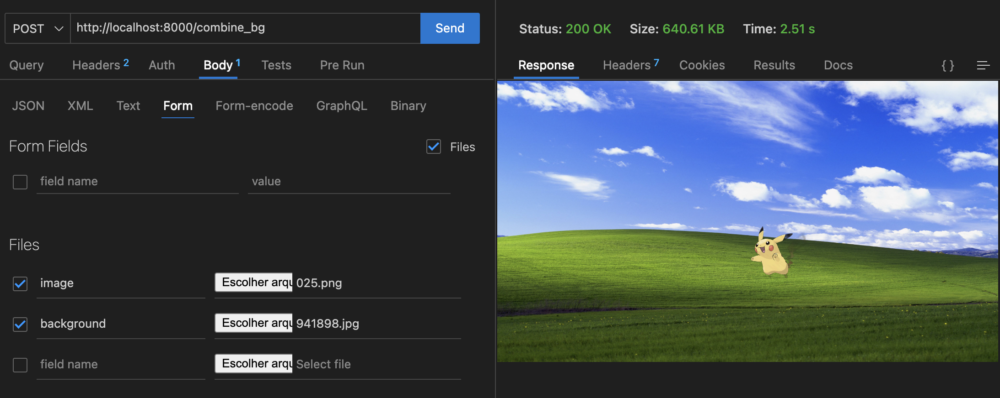

# Desenvolvimento em Aula Encontro 10

Ao longo deste encontro, vamos desenvolver uma aplicação que remove o fundo de uma imagem e faz a sua combinação com a imagem de fundo, também enviada pelo usuário.

As tecnologias utilizadas para sua construção serão:
- AWS SQS
- RabbitMQ
- OpenCV, Pillow e REMBG (Python)
- Python
- Docker
- Celery
- FastAPI
- HTMX | Reflex

## 1. Configuração do ambiente

A aplicação será desenvolvida em dois cenários distintos, o de uma aplicação monolítica e uma aplicação com microserviços.
Vamos trabalhar primeiro com uma aplicação monolítica, para depois separar as funcionalidades em microserviços.

Nosso arquivo ***requirements.txt*** deve conter as seguintes dependências, para a aplicação monolítica:

```txt
fastapi
uvicorn
rembg
pillow
python-multipart
```

Nossa aplicação Python deve conter o seguinte código:

```python
from PIL import Image
from rembg import remove
from fastapi import FastAPI, UploadFile
from fastapi.responses import FileResponse

NO_BG_IMAGE_NAME = "no-bg.png"

def remove_br(image):
    try:
        bytes_data = Image.open(image)
        output = remove(bytes_data)
        Image.frombytes("RGBA", output.size, output.tobytes()).save(NO_BG_IMAGE_NAME)
        return True
    except Exception as e:
        print(e)
        return False

app = FastAPI()


@app.get("/")
async def root():
    return {"message": "Hello World"}

@app.post("/remove_bg")
async def remove_bg(image:UploadFile = None):
    if not image:
        return {"message": "No image"}
    if remove_br(image.file):
        return FileResponse(NO_BG_IMAGE_NAME)
    return {"message": "Error"}
```

Vamos chamar nosso código de ***backend.py***. Para executar a aplicação, basta executar o seguinte comando:

```bash
python -m uvicorn backend:app 
```

Para testar nossa aplicação, vamos fazer uma requisição do tipo POST, enviando uma imagem para o endpoint */remove_bg*. Podemos fazer isso utilizando o [Postman](https://www.postman.com/), o [Insomnia](https://insomnia.rest/) ou o plugin [Thunder Client](https://www.thunderclient.com/).


Agora vamos criar uma outra rota que recebe a imagem de fundo e faz a combinação com a imagem sem fundo. 

```python
from PIL import Image
from rembg import remove
from fastapi import FastAPI, UploadFile
from fastapi.responses import FileResponse

NO_BG_IMAGE_NAME = "no-bg.png"

def remove_br(image):
    try:
        bytes_data = Image.open(image)
        output = remove(bytes_data)
        Image.frombytes("RGBA", output.size, output.tobytes()).save(NO_BG_IMAGE_NAME)
        return True
    except Exception as e:
        print(e)
        return False

app = FastAPI()


@app.get("/")
async def root():
    return {"message": "Hello World"}

@app.post("/remove_bg")
async def remove_bg(image:UploadFile = None):
    if not image:
        return {"message": "No image"}
    if remove_br(image.file):
        return FileResponse(NO_BG_IMAGE_NAME)
    return {"message": "Error"}

@app.post("/combine_bg")
async def combine_bg(image:UploadFile = None, background:UploadFile = None):
    if not image or not background:
        return {"message": "No image or no background"}
    if remove_br(image.file):
        try:
            bytes_data = Image.open(NO_BG_IMAGE_NAME)
            bg = Image.open(background.file)
            bg.paste(bytes_data, (bg.width//2, bg.height//2), bytes_data)
            bg.save(NO_BG_IMAGE_NAME, "JPEG", optimize=True,)
            return FileResponse(NO_BG_IMAGE_NAME)
        except Exception as e:
            print(e)
            return {"message": "Error"}
    return {"message": "Error"}
```

Agora temos uma segunda rota que além de remover o fundo de uma imagem, faz sua junção com outra imagem de fundo.



